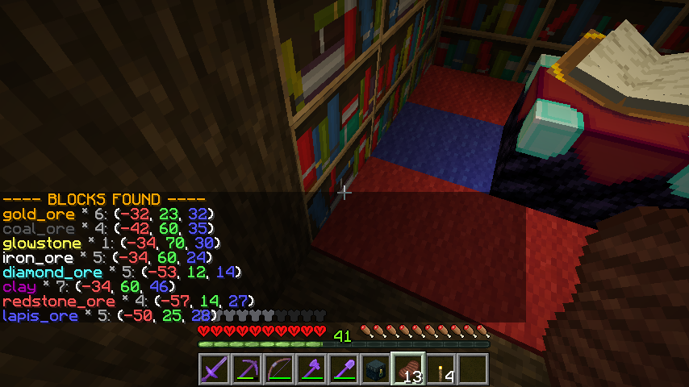

# Bukkit Finder 

Minecraft  [Bukkit](https://bukkit.org) server plugin for finding nearby block veins (usually valuable ores)
and entities. Some may consider this cheating... meh.

## Installation

If you just want to run the plugin, simply download the latest plugin version from the [Finder](https://dev.bukkit.org/projects/finder)
project on dev.bukkit.org and place it in your server's `plugins` directory.

## Building from source

Building requires Maven, installation of which will not be covered here. See the [Maven](http://maven.apache.org/)
project for details on how to set that up.

Building the jar file:

```shell
$ mvn install
```

You should see output similar to:

```
[INFO] --- maven-install-plugin:2.4:install (default-install) @ finder ---
[INFO] Installing D:\...\bukkit-finder\target\finder-1.0.jar to C:\...\.m2\repository\org\kowboy\bukkit\finder\1.0\finder-1.0.jar
[INFO] Installing D:\...\bukkit-finder\pom.xml to C:\...\.m2\repository\org\kowboy\bukkit\finder\1.0\finder-1.0.pom
```

Copy the jar file to your server `plugins` directory and restart your server.

## Usage

There are four basic commands. Two of the commands expect an argument specifying the type being 
searched for. The no-args commands simply look for the closest instances of each type.

### Finding Veins (Blocks)

#### /find-blocks
Veins of particular block types can be found using the `/find-blocks` command. The output will show
the closest vein of each type found, the number of blocks in the vein, and approximate coordinates.
The types of blocks searched for is specified in [config.yml](config.yml). Here is some sample output:



#### /find-block <block_type>
Searches for nearby veins of a specific type using `/find-block <block_type>`. For example, 
`/find-block diamond_ore` will return the nearest veins of diamond ore. For each it will show
the number of blocks in the vein and approximate coordinates, like so:


### Finding Entities (Mobs)

#### /find-entities
Searches for all the living entities of types configured by [config.yml](config.yml). For each
type found, it will display the total number of that type and the coordinates of the closest one.
Here is some sample output:


#### /find-entity <entity_type>
Searches for entities of the given type and displays several of the closest ones and their 
coordinates, like so:


## Configuration

See [config.yml](config.yml) for the full default configuration. Here is a sample from it:

```yaml
block-whitelist:
  - diamond_ore
  - emerald_ore
  - gold_ore

entity-blacklist:
  - bat
  - chicken
  - cod
```

As you can see, we whitelist block types for the `find-blocks` command and blacklist entity
types for the `find-entity` command. Feel free to tweak this config to suit your needs.

## License

```
MIT License

Copyright (c) 2018 Mariell Hoversholm

Permission is hereby granted, free of charge, to any person obtaining a copy
of this software and associated documentation files (the "Software"), to deal
in the Software without restriction, including without limitation the rights
to use, copy, modify, merge, publish, distribute, sublicense, and/or sell
copies of the Software, and to permit persons to whom the Software is
furnished to do so, subject to the following conditions:

The above copyright notice and this permission notice shall be included in all
copies or substantial portions of the Software.

THE SOFTWARE IS PROVIDED "AS IS", WITHOUT WARRANTY OF ANY KIND, EXPRESS OR
IMPLIED, INCLUDING BUT NOT LIMITED TO THE WARRANTIES OF MERCHANTABILITY,
FITNESS FOR A PARTICULAR PURPOSE AND NONINFRINGEMENT. IN NO EVENT SHALL THE
AUTHORS OR COPYRIGHT HOLDERS BE LIABLE FOR ANY CLAIM, DAMAGES OR OTHER
LIABILITY, WHETHER IN AN ACTION OF CONTRACT, TORT OR OTHERWISE, ARISING FROM,
OUT OF OR IN CONNECTION WITH THE SOFTWARE OR THE USE OR OTHER DEALINGS IN THE
SOFTWARE.
```

